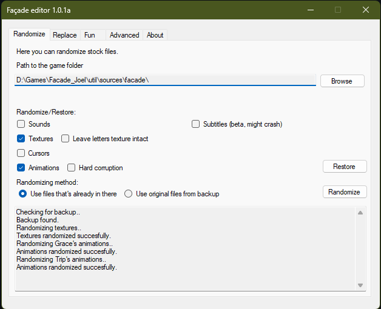
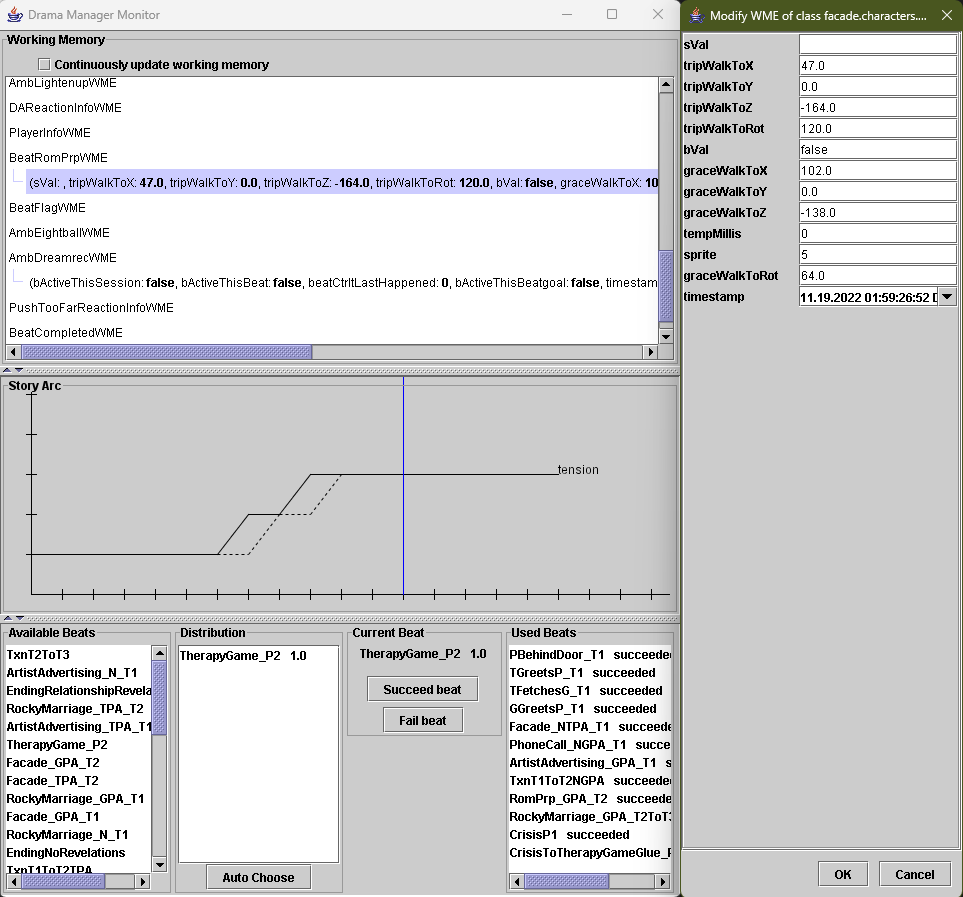
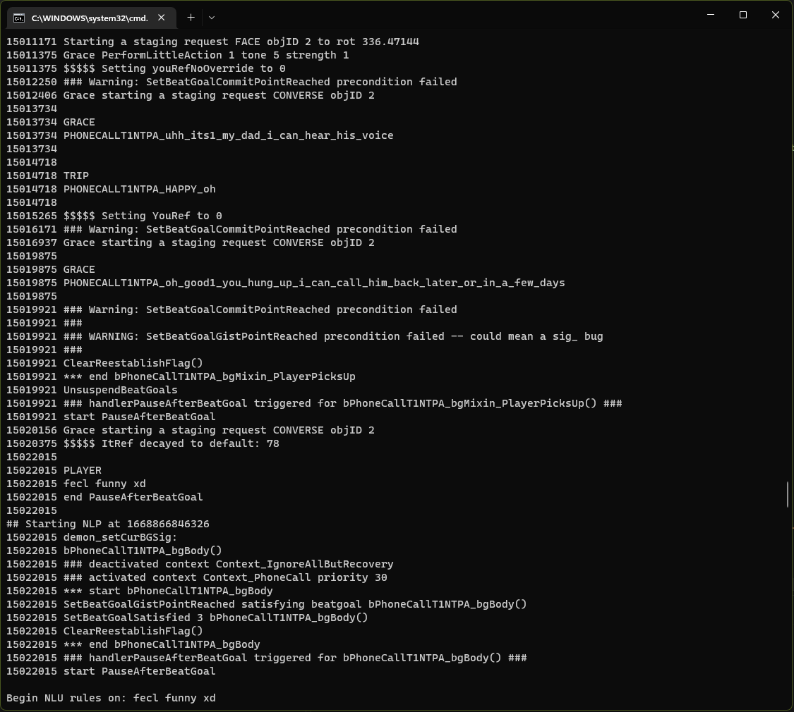

# Façade Editor
Randomizer, corruptor, and more for the game named Façade

## What does it do?

- Randomize sounds, textures, cursors, animations
- Replace(mix in) your own sound files (supports automatic downsampling and mp3, ogg, wav files) 
- Decompile .bin, .map, .rul files (All of them are written in Java Jess rule language)
- Enable never seen before(?) built in debug features like "Drama manager monitor" or "AI Log" and more

## Download

[Here](https://github.com/G4B33/facade_editor/releases)

## Plans on future releases

- Subtitle editor (The basics are done, I can read and replace it, just need to assign the sound files to their corresponding subtitles, and make some kind of editor that's easy to use)
- Lower Windows requirement to XP (Currently supports Windows 7 x86,x64 and up because of .Net 4.7.2 requirement for NAudio library)
- Face manipulator (Don't count on this one, I'm not 100% sure that it will work)

## How to build

- Open facade_editor.sln in Visual Studio
- Press F6

## License

This is licensed under GNU GPLv3.
